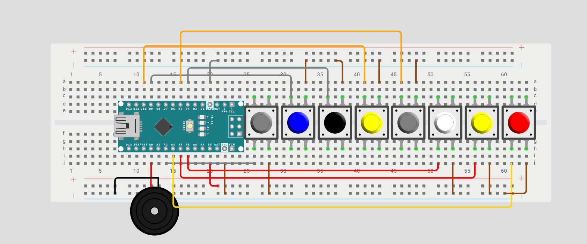

# Portable Piano

A portable, mini piano that can play 1 full octave using **8 Pushbuttons and a Passive Buzzer**.

---

## 🚀 How It Works

Each button has a specific tone assigned to it; when pressed, that passive buzzer will initiate that tone. The 8 pushbuttons have the following tones: C, D, E, F, G, A, B, High C like on a piano! 

### Hardware
- **Development Board:** Arduino Nano
- **Main Component(s):** Passive Buzzer
- **Software:** Arduino IDE

### Cool Features
- Portability
- Piano functionality
- One full octave of keys

---

## 📊 Circuit Layouts

### Wiring Diagram

Below is the wiring diagram for the project:

**Note: This wiring diagram was made in Wokwi. Since Wokwi doesn't have a Power MB V2, the wiring diagram is an approximation of the physical build but retains the correct wiring and functionality.**

### Schematic

Below is the schematic generated in Tinkercad:

*Schematic coming soon*

## 🔗 Wokwi Simulation
Try the interactive simulation of the project here:

[Open in Wokwi](https://wokwi.com/projects/476890919620909057)

---
## 🖼️ Project Photo

See the project (may have some issues viewing it on desktop):

[Click here](Portable_Piano_Image.png)

## 🎥 Video Demonstration

Watch the project in action + an explanation of the build:

[▶ Watch the Video](https://www.youtube.com/watch?v=psv5oNLDCZ4)

---

## 📁 Repository Contents

- `Mini_Portable_Piano.ino` — Arduino source code
- `README.md` — Project documentation
- `LICENSE` — Apache License 2.0
- `Portable_Piano_Image.png` — Project photo
- `Portable_Piano.png` — Wiring Diagram 
- `Schematic.png` — Coming Soon!

---

## 🛠️ Components Used

- Arduino Nano Board
- Passive Buzzer
- 8 Pushbuttons
- Power MB V2 + 9V Battery
- Jumper wires

---

## 💡 What I Learned

I learned to add sound and incorporate real-life mini versions of instruments into my projects. 

---

## 📜 License

This project is licensed under the Apache License 2.0.
